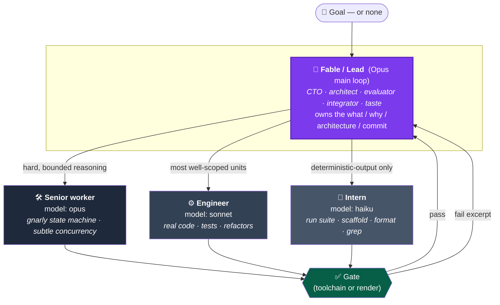
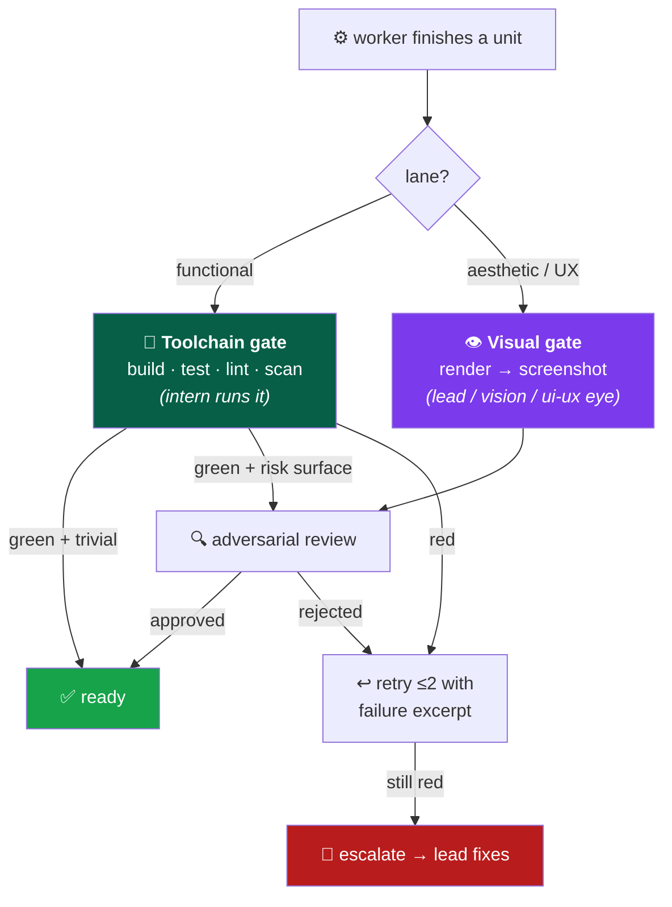

<div align="center">

# 🧠 fable-team

### One lead model owns the goal. A crew of cheaper models executes.

*A Claude Code slash command that runs your build like a real engineering team — an obsessed CTO up top, well-scoped workers below, and the toolchain as the cheap evaluator.*

[](https://docs.claude.com/en/docs/claude-code)
[](LICENSE)
[]()

</div>

---

## Why

Letting your most expensive model type every line is slow and wasteful. Delegating blindly to cheap models is *worse* — the lead burns its scarce tokens diagnosing bad output and re-stitching fragments.

**fable-team** splits the two jobs a team actually has:

| Judgement (expensive, scarce) | Execution (cheap, high-volume) |
|---|---|
| synthesize the goal · innovate · pick best practice · architect · decompose · evaluate failures · integrate · **taste** | type the code · write the tests · scaffold · format · run the suite |

The lead spends its tokens on judgement. The crew does the typing. **The toolchain — not the lead — proves the work correct**, so the lead reads only what fails. Done right, this is dramatically cheaper than the lead doing it all. The decomposition is the whole game.

---

## The team



> **Tier rule:** pick the *cheapest* tier that can do the unit **right**.
> A senior worker costs the same per token as the lead — its value is **parallelism + context isolation**, not price. Architecture, integration, and anything touching auth / secrets / merge / commit never leave the lead.

---

## From a vague goal to shippable units

```mermaid
flowchart LR
    A["💭 Goal<br/>(literal request)"] --> B["🔮 <b>Synthesize</b><br/>reshape to what<br/>actually serves"]
    B --> C["🔬 <b>Research</b><br/>best practice<br/>(time-boxed)"]
    C --> D["🏛️ <b>Architect</b><br/>boundaries · data flow<br/>· failure modes · taste"]
    D --> E["🧩 <b>Decompose</b><br/>fewest provable units"]
    E --> CP{{"🚦 Checkpoint<br/>you approve scope"}}
    CP --> F["🏗️ <b>Fan out</b><br/>workers execute"]
    F --> M["🪡 <b>Integrate</b><br/>lead stitches +<br/>commits"]

    style B fill:#7C3AED,color:#fff
    style D fill:#7C3AED,color:#fff
    style E fill:#7C3AED,color:#fff
    style CP fill:#b45309,color:#fff
    style M fill:#065f46,color:#fff
```



**The lead is obsessed with the goal — but inside an approved box.** It innovates, picks best practice, and holds *taste* as a real acceptance criterion. But all of that happens **in the plan**. You approve the scope at the checkpoint; *then* it runs autonomously. Obsession inside the box is the leverage. Obsession defining its own box is expensive drift — the checkpoint is the leash.

### Right-sizing, not max tasks

The binding constraint on a unit isn't *"small enough for a cheap model to type"* — it's **"provable correct by a single pass/fail command."**

> A unit whose correctness only the lead reading the diff can judge does **not** get cheaper by splitting it smaller — you still pay the lead to judge it. Decompose to the **fewest** units that each clear the rubric, then stop. Every extra unit adds spin-up + integration tax that can erase your savings.

A unit may be delegated only if **all** hold:

- ✅ **Provable by a command** — a test, build, lint, curl, grep, or a render the lead can look at
- ✅ **Bounded surface** — one file or a tight, nameable cluster
- ✅ **Self-contained** — the spec carries every fact; no whole-system reasoning needed
- ✅ **Cheap-to-judge failure** — wrongness shows up red, not as something only a careful read catches

---

## The two-lane gate

The token saving rests on *the toolchain proves correctness, the lead reads only failures*. But a build/test/lint **cannot** prove "this looks good." So units run in one of two lanes:



- **Functional lane** (most units) → gated by the toolchain. The lead reads only failure excerpts. *Never* re-reads a green diff to "confirm" it — the gate already did.
- **Aesthetic / UX lane** → gated by a **visual pass**. Layout, spacing, hierarchy, motion, copy, and flow can't be script-proven, so they render to an artifact and get judged by something with eyes. Aesthetics aren't free — the lead budgets reads for exactly these and nothing else.
- **Selective review** — only units touching a **risk surface** (concurrency, process lifecycle, auth, secrets, money, data loss, public API) get an adversarial review. Trivial green units ride the gate alone.

---

## Install

Custom slash commands live in `~/.claude/commands/`. Drop the file in:

```bash
git clone https://github.com/SyaugiAlkaf/fable-team.git
cp fable-team/commands/fable-team.md ~/.claude/commands/
```

Restart Claude Code (or start a new session). `/fable-team` is now available.

## Usage

```bash
/fable-team <goal>        # scope, research, architect, decompose, orchestrate the build
/fable-team               # no goal: read GOALS.md + docs + code and synthesize the goal itself
/fable-team --plan-only   # produce the goal + architecture + unit breakdown, then stop
/fable-team --go          # skip the checkpoint; architect and fan out in one shot (small, clear goals only)
```

By default the lead pauses at a **checkpoint** — it shows you the synthesized goal, the architecture, the unit breakdown, the per-unit model assignment, and a rough token estimate. You say yes, and it runs autonomously until done or genuinely blocked.

### The solo-floor

Orchestration has overhead. If the whole job is a handful of edits the lead could finish in one pass, **it just does it** — no fleet, no workflow. Fan out only when execution volume genuinely dwarfs the orchestration cost: a real subsystem, a broad sweep, a thorough audit, or several parallel hard units.

---

## How it runs under the hood

The lead does research + architecture + decomposition in the main loop, then hands a unit list to Claude Code's **Workflow** tool, which pipelines `implement → gate → (selective) review`. Workers return compact, schema'd results (`{unit, status, files_changed, failure_excerpt}`) — **not whole files**. Diffs live on disk; the lead reads only failures, aesthetic renders, integration seams, and the final review.

```
implement (engineer/senior)
  → gate  (intern runs build + test + lint   |   render → visual eye)
    → pass + risk surface → adversarial review → ready
    → pass + trivial      → ready              (the gate is enough)
    → fail → retry ≤2 with the excerpt → still red → escalate to lead
```

---

## Guardrails

The skill is generic; **enforcement lives in your own rules**. It reads your global rules and the project's `CLAUDE.md` first and they win — branch model, pre-commit/secret gate, author identity per remote, never committing planning artifacts, and flagging sensitive-domain work rather than silently proceeding. The lead runs every commit; workers never commit.

---

<div align="center">
<sub>Built for <a href="https://docs.claude.com/en/docs/claude-code">Claude Code</a> · Apache-2.0</sub>
</div>
